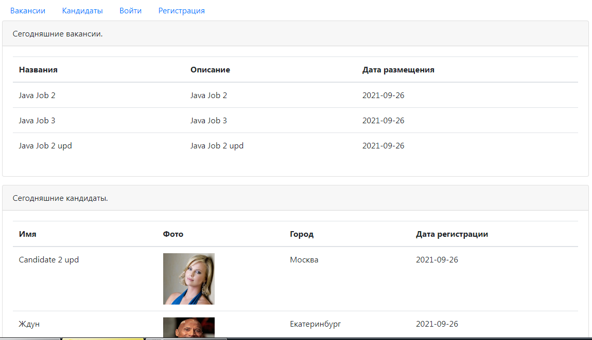
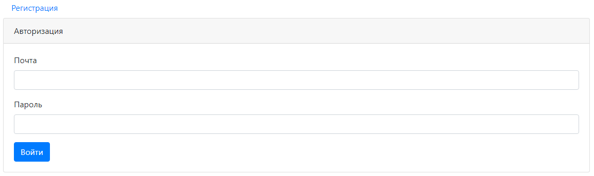
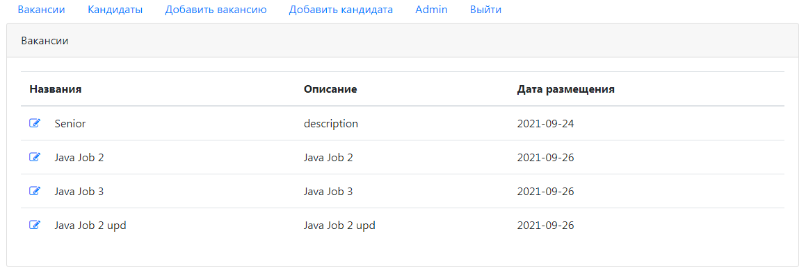
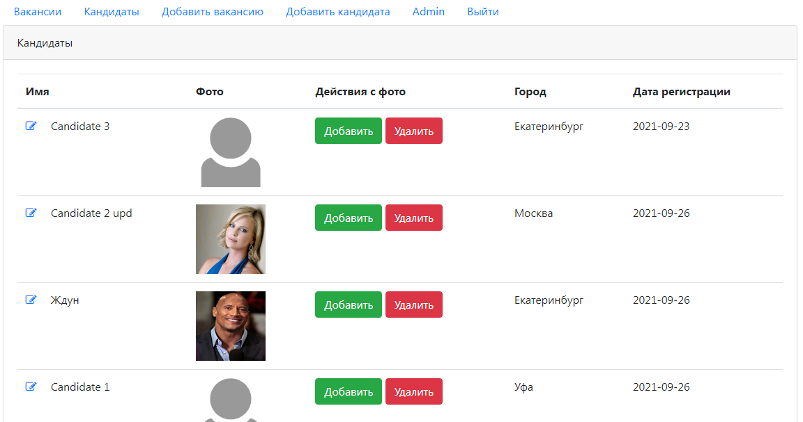
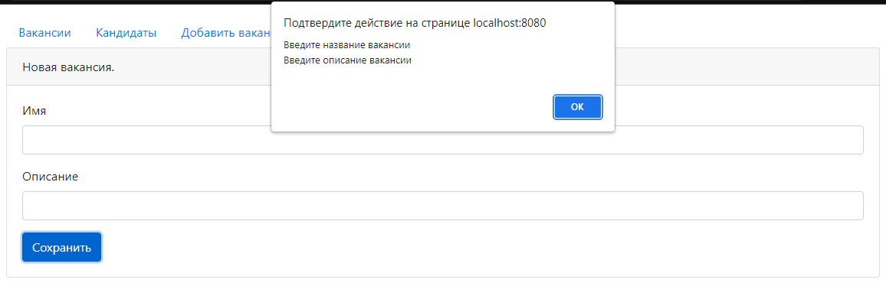
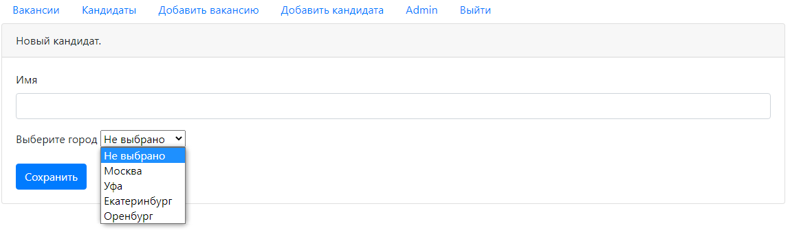

# job4j_dreamjob

В данном проекте реализована биржа труда:

Кадровики могут публиковать открытые вакансии.

Кандидаты могут публиковать информацию о себе.

В данном проекте применены технологии: JSP, Bootstrap, скриплеты, Servlet,

шаблон MVC, JSTL, PostgreSQL, JavaScript, AJAX, JSON

Проект разворачивается на сервере Apache Tomcat. Все данные хранятся в PostgreSQL

Скриншоты:
1. На главной странице отображаются вакансии и кандидаты за последний день

2. Просмотр, добавление и редактирование доступно после авторизации

3. Список всех вакансий

4. Список всех кандидатов. Есть возможность загрузить фото

5. Есть валидация введенных данных

6. Можно выбрать город проживания кандидата
